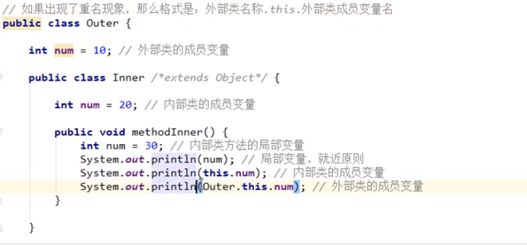

# Java

##### 1.字符串对象

```java
String s1 = "Java"  #新建一个对象

String s2 = "Java"  #并没有新建，而是指向了上一步创建的那个对象

String s3 = s2;     #也是指向已经创建好的"Java"对象

String s4 = new String("Java")  #新建了
```

##### 2.equals()和"=="的区别：equals()是判断character是否相等，而“==”是判断是不是同一个对象。

##### 3.toCharArray()返回的是array的copy

##### 4.FileInputStream 和 FileOutputStream用法例如:

```java
File file = new File("test.txt");
FileInputStream fs = new FileInputStream(file);
byte[] fileContent = new byte[(int)file.length()];  //这里只是定义了一个大小为file.length()的数组，但是没传东西
fs.read(fileContent);//到这一步才是真正将文件内容读取到了数组中  之后直接用这个数组就行了
```

##### 5.第4介绍的方法都是以数字读取的，例如文件里是'a'，读取后输出为'97'，下面这种方法是以字符串读取：

```java
File file = new File("test.txt");
FileReader fr = new FileReader(file);
char[] data = new char[(int)file.length()];
fr.read(data);
fr.close();
```

##### 6.按object删除List中元素，要用迭代器：`Iterator iter`，还要判断list中是否还有元素：`iter.hasNext()`,`if(iter.next().equals(要删除的元素))`就执行`iter.remove()`。

##### 7.Queue  :使用q.offer()添加元素。

##### 8.ArrayList和LinkedList比较：LinkedList直接插入数据更快(比如在数组最前面或者最后面插入元素)；但是如果要定位到第i个位置取出元素或者插入元素，那ArrayList快很多。

##### 9.对于HashMap定义的对象，插入元素用.put()；对于HashSet定义的对象，插入元素用.add();List定义的对象也是用add()。

##### 10.HashSet怎样判断值是否重复：

​       HashSet没有自身的实现，而是里面封装了一个HashMap，所以本质上就是判断HashMap的key是否重复。key是否重复，是由两个步骤判断的：

-  如果hashcode不一样，就是在**不同的坑里**，一定是不重复的
- 如果hashcode一样，就是在**同一个坑里**，还需要进行equals比较（如果equals一样，则是重复数据，不一样就是不同数据）。

##### 11.泛型

java中的泛型是伪泛型，是通过泛型的类型擦除实现的，如果没有上下界就会转化成Object，例如List<Integer>被擦除后类型变为Object，而List<T extends Comparable>被擦除后变为Comparable。取的时候再强制转化成原本的类型。

泛型的参数类型只能是类，例如List<Integer> 不能是简单类型，例如List<int>

##### 泛型` <? extends Hero>`是只能取不能加，因为加的话不确定到底是Hero类还是它的子类；

##### ` <? super Hero>`是只能加不能取，因为取的话如果取的是Object，就会强转成Hero失败。

##### 子类泛型不能转换为父类泛型，父类泛型也不能转换为子类泛型。

##### 含有泛型的方法：

##### 修饰符 <泛型> 返回值类型  方法名(参数列表（使用泛型)){

​       方法体；

##### }

##### 泛型通配符

传递的数据中，泛型类型不确定时可以使用通配符<?>表示。

##### 泛型擦除

泛型擦除是泛型信息在源代码里面有，而在生成的字节码里面就没有了。怎么来证明的确在编译后泛型被擦除掉了呢？

```java
public class Test {

    public static void main(String[] args) throws Exception {

        ArrayList<Integer> list = new ArrayList<Integer>();

        list.add(1);  //这样调用 add 方法只能存储整形，因为泛型类型的实例为 Integer

        list.getClass().getMethod("add", Object.class).invoke(list, "asd");

        for (int i = 0; i < list.size(); i++) {
            System.out.println(list.get(i));
        }
    }

}
```

通过反射调用add方法可以存储字符串，说明被擦除掉了。

##### 问：既然类型变量在编译时会被擦除掉，那么为什么不能往<Integer>中加String类型的数呢？

因为java编译器是先检查代码中泛型的类型，再进行类型擦除，再编译。而且类型检查是针对引用的，无关它真正引用的对象：

```java
ArrayList list1 = new ArrayList<String>(  );
list1.add( "1" );
list1.add( 1 );
//都编译通过
```


##### 12.运行时异常和非运行时异常的区别。

运行时错误是RunTimeException类或其子类，一般是由程序逻辑问题引起的，如果不进行异常处理，线程或程序将在问题处中断（或main函数处中断）;  非运行错误是RuntimeException以外的异常，类型上都属于Exception类及其子类，java编辑器要求必须对这类异常进行处理。


#### 内部类

分类：1. 成员内部类  2.局部内部类（包含匿名内部类）

内部访问外部的变量，是随意访问；外部要访问内部，需要内部类对象。

#### 成员内部类

使用成员内部类有两种方式：

1.间接。外部类的方法中使用内部类，然后Main调用外部类的方法。

2.直接。外部类名称.内部类名称 对象名 = new 外部类名称().new 内部类名称()；

比如说外部类是Body 里面有个成员内部类Heart  那直接方式是Body.Heart heart = new Body().new Heart(); 然后通过heart可以调用Heart的方法。

##### 变量重名



methodInner()的输出依次为30  20  10。

#### 局部内部类

这个类是定义在一个方法内部的。

局部内部类只能所在的方法能调用：

```java
class Outer{
    public void methodOuter(){
        class Inner{ //局部内部类  不能写修饰符
            int num = 10;
            public void methodInner(){
                System.out.println(num);  //10
            }
        }
        Inner inner = new Inner();
        inner.methodInner();
    }
}
public class Demo{
    public static void main(String[] args){
        Outer outer = new Outer();
        outer.methodOuter();  //成功输出10
    }
}
```

注意：若局部内部类想访问所在方法的局部变量，那么这个局部变量必须是有效final的。（从java8开始不加final也行，但要保证是不变的)

```java
class Outer{
    public void methodOuter(){
        int num = 20;  //所在的方法有一个局部变量num
        //num = 10;  加这句会报错  num不能变
        class Inner{ //局部内部类 
            public void methodInner(){
                System.out.println(num);  //可以访问  为20
            }
        }
        Inner inner = new Inner();
        inner.methodInner();
    }
}
```

上述的原理：

因为局部变量是跟着方法走的，是在栈内存中。而new出来的对象在堆当中持续存在直到垃圾回收消失。所以这个methodOuter方法完成后，其局部变量num就立刻消失了，但是inner对象可能还活着，它还要继续调用num，就得保证这个num是唯一不变的，才能继续使用这个“常量”。

##### 小结类的权限修饰符：

外部类：public/default

成员内部类：public/protected/(default)/private

局部内部类：什么都不能写

#### 匿名内部类（重要）

定义格式：

接口名 对象名 = new 接口名(){

​        //覆盖重写所有的抽象方法

}

当接口的实现类只需要使用一次的时候，使用匿名内部类就可以不用`重新定义一个实现类.java并且重写接口中的方法了`。

匿名内部类和匿名对象不是一回事。


#### toString和equals方法

Object的toString()方法，获取的就是对象的地址值，和直接打印对象名输出结果一样。

直接输出地址是无意义的，所以一般都会去重写toString方法。

如果重写了，那么再打印对象的名字，输出的就是我们重写的。

java中Scanner、ArrayList都重写了toString()。

##### Object的equals()：

Person p1 = new Person(....)

Person p2 = new Person(...)

p1.equals(p2)   //输出为false

查看equals源码：

```java
//Object中的equals:
public boolean equals(Object obj) {
    return (this == obj);
}
//this就是谁调用了这个方法就指的是谁  这里指的是p1
//而== 如果是引用类型，则比较的是地址值
```

比较两个对象的地址值一般也没啥意义，所以我们需要重写equals方法，去比较属性值是否一样。

String类是重写了equals()方法了的。


#### 序列化与反序列化

把对象以流的方式写入到文件中保存，叫写对象，也叫对象的序列化。

把文件中的内容读出来重建对象，叫读对象，也叫对象的反序列化。

要进行序列化和反序列化的类必须实现Serializable接口。


------

### 2020.5.6

##### 1.String 、StringBuilder、StringBuffer

String是不可变序列，因为源码里面用来存储字符数组的对象前面用了`final`。

```java
String str1 = "hello"+"java";
String str2 = "hellojava";  //str1==str2
String str3 = "hello";
String str4 = "java";
String str5 = str3 + str4;//str2!=str5
```

`StringBuilder`和`StringBuffer`都可变。

`StringBuilder`线程不安全，但是效率高；`StringBuffer`线程安全但是效率较低。

`StringBuffer`的方法都是由synchronized修饰的，所以是线程安全的类。

如果有如下代码：

```java
String str = "";
for(int i = 0 ;i<100;i++){
    str = str + i;
}
```

会占用大量内存，因为`String`不可变，每次循环都会产生一个新的无用对象。所以这种代码最好用`StringBuilder`。

##### 2. Servlet

Servlet就是一个接口，定义了java类的规则让其被tomcat识别。servlet要运行在tomcat或者web服务器中。

servlet的生命周期:

​      **被创建**：执行init方法   可以通过<load-on-startup>来修改init的调用时刻，如果是负数则在第一次被访问时才被调用，如果为0或者正整数，则服务器一被创建就启动。注意：init方法只会执行一次，说明一个Servlet在内存中只有一个init，导致多个用户访问时，可能存在线程安全问题。所以尽量不要在Servlet中定义成员变量，即使定义了成员变量，也不要对其修改值。

​      **提供服务**：执行service方法，执行多次。

​      **被销毁**：执行destroy方法，只执行一次。只有服务器正常关闭时才执行。是在服务器被销毁前执行，一般用于释放资源。

Servlet3.0好处：在类上使用@WebServlet注解，进行配置，就不需要创建web.xml。

Servlet有两个抽象类：GenericServlet、HttpServlet。

Servlet相关配置：

​        urlpatterns:访问路径  一个Servlet可以定义多个访问路径。这个路径有很多个写的方法，如果为("*.io")，则通过/demo.io可以访问，io也可以换成其他任意。


------

### 2020.5.7

##### 1.HTTP  

   Hyper Text Transfer Protocol 超文本传输协议

   特点：基于TCP/IP的高级协议  默认端口为80  基于请求/响应模型：一次请求对应一次响应  每次请求之间相互独立，不能交互数据。

   请求消息数据格式：请求行、请求头、请求空行、请求体（正文）

   常见的请求头：User-Agent

​                  Referer:告诉服务器，当前请求从哪里来？（可以做统计工作和防盗链）

   HTTP协议有7种请求方式，常用的有两种：GET、POST

​            GET：请求参数在请求行中，在url后面；请求的url长度是有限制的；不太安全。

​            POST：请求参数在请求体中；请求的url长度没有限制；相对安全。

​    

##### 2.数据库连接池

其实就是一个存放数据库连接的容器

好处：节约资源、用户访问高效

如果不用连接池的话，使用connection.close()就是直接丢弃了连接对象，但如果使用了连接池，就是归还而不是舍弃。

##### 3.用户登录案例

使用`Druid+Tomcat+HttpServlet+MySQL`实现用户登录，项目位于j2ee/day14_test。


------

### 2020.5.8

#### Request对象

##### 1.响应行的组成：协议/版本，响应状态码，状态码描述

​           响应状态码：服务器告诉客户端浏览器本次请求和响应的一个状态。

​                   状态码都是3位数字：

​                    1xx：服务器接收客户端消息，但没有接收完成，等待一段时间后，发送1xx码，意思是问客户端你还要不要发消息。

​                    2xx：成功  例如200

​                    3xx：重定向    代表：302（重定向）  304（访问缓存）

​                    4xx：客户端错误  404(请求的路径没有对应的资源)   405（请求方式没有对应的doxx方法）

​                    5xx: 服务器端错误   500（服务器内部出现异常）

##### 2.响应头

​           Content-Type:服务器告诉客户端本次响应体数据的格式以及编码格式。比如说字符编码是utf-8，那浏览器解析就是utf-8，如果是gbk浏览器也是gbk。

##### 3.响应体：真实传输的数据


#### Response对象  :hugs:

##### 功能：设置响应消息

​           设置响应行

​           设置响应头：`setHeader(String name,String value)`

​           设置响应体​ :获取输出流（字符和字节输出流）  使用输出流

##### 重定向(redirect)特点

​           重定向是两次请求，所以`不能使用request对象来共享数据`

​           重定向的地址栏会发生变化，且可以访问其他站点资源

##### 转发（forward）的特点   

​           转发的地址栏路径不变

​           转发只能访问当前服务器下的资源

​           转发是一次请求，可以使用request对象来共享数据

路径写法

​       1.相对路径：以.开头   使用相对路径要找到当前资源和目标资源之间的相对位置关系（./是当前目录  ../是后退一级目录）

​        2.绝对路径： （简单路径）：/day15/responseDemo2

​                            给客户端使用：需要加虚拟目录  建议使用request.getContextPath()动态获取虚拟目录

​                            给服务器使用，比如转发路径  不需要加虚拟目录


##### 服务器输出字符数据到浏览器，要注意乱码问题，用`response.setContentType("text/html;charset=utf-8");`

​                                         

------

### 5.9  ​ ​ :blue_heart::accept:

#### ServletContext对象  

​        代表整个web应用，可以和程序的容器（服务器）来通信。

​        获取：1.通过request对象来获取        2.通过HttpServlet获取

​        功能：1.获取MIME类型  MIME是互联网通信过程中定义的一种文件数据类型

​                    2.域对象：共享数据   对象范围：所有用户所有请求的数据（所以需谨慎使用）

​                    3.获取文件的真实（服务器）路径

###### 案例：文件下载 ——点击超链接完成图片下载

​          分析：超链接指向的资源如果能被浏览器解析，则在浏览器中展示，如果不能解析，则弹出下载提示框。但是我们的需求是任何资源都必须弹出下载提示框。

​          方法：

​          1.编辑超链接href属性指向servlet，传递资源名称filename

​          2.定义servlet: 获取文件名称，加载文件进内存（涉及到上面说的文件真实路径），指定response的响应头，将数据写出到response输出流

​          问题：中文.jpg 有问题  不同的浏览器对中文解析不一样

​          完美解决中文问题：要加上`filename = new String(filename.getBytes("ISO8859-1"),"UTF-8");`    这句。

​          项目位于`day15_response/src/cn.itcast.web/download/DownloadServlet.java`

#### 会话技术

##### 会话：一次会话包含多次请求和响应。

注意：HTTP是无状态的，无状态就是说浏览器和服务器的一次请求和响应与其他的请求响应无关。

会话的功能：在一次会话的范围内的多次请求间，共享数据。

会话的方式：客户端会话数据：cookie       服务器会话数据：session

##### Cookie的特点和作用：

特点： Cookie存储数据在客户端浏览器

​             对于单个Cookie存储大小有限制

作用：一般用于存储少量的不太敏感的数据

​            在不登录的情况下完成服务器对客户端身份的识别

###### 案例：记住上一次访问时间——是否第一次访问Servlet

​           位于day16_cookie&session下的CookieTest.java


#### JSP入门 ​ ​ :hugs:

概念：java server pages:java服务器端页面

​            可以理解为一个特殊的页面，既可以定义html标签，又可以定义java代码

<%= %>是写java代码

#### Session

 概念：服务端会话技术，在`一次会话`的多次请求间共享数据，将数据保存在服务端的对象中。

服务器是通过cookie的方式确保在一次会话范围内，多次获取的session对象是同一个：第一次获取session时会创建一个新的session对象，并且有一个id号，响应头会存JSESSIONID，下一次会话时会去检查有没有JSESSIONID。

##### 原理：Session的实现是依赖于cookie的。

细节：

#####         1.客户端关闭，服务器不关闭，两次获取的session是否是同一个？

​         默认情况下不是。如果希望相同，则创建Cookie，键为JSESSIONID，设置最大存活时间。

#####         2.客户端不关闭，服务器关闭，两次session是否为同一个？

​         不是，但是要确保数据不丢失，不然服务器重新启动的话，用户的数据就会丢失。

​          session的钝化：在服务器正常关闭之前，将session对象序列化到硬盘上

​          session的活化：在服务器启动后，将session文件转化为内存中的session对象。

​           tomcat可以完成上述。

###### 案例：验证码

​          页面有用户名、密码、验证码，`要先判断验证码`，因为如果先判断用户名和密码是否正确的话，要去数据库查询进行判断，增加了数据库的开销。

​          判断验证码：要从session中获取程序生成的验证码。

​          若验证码不正确，给用户提示信息：验证码错误 request   跳转登录页面(转发)

代码位于day16_cookie&session/servlet


### 5.10  :jack_o_lantern:

#### JSP:

​        指令  ：用于配置JSP页面，导入资源文件 <%@ %>

​                  page :配置jsp页面  include:导入页面的资源文件   taglib:导入资源

​        注释: <!-- -->只可以注释html    <%-- --%>可以注释所有

​        内置对象：在jsp页面中不需要创建可以直接使用的对象

​                           共9个

#### MVC开发模式

如果过度使用jsp，在jsp中写大量java代码和html表，造成难于维护，难于分工。

后来java的web开发借鉴mvc开发模式，使得程序的设计更加合理性。

M: model模型

​     是完成具体的业务操作  如封装数据   查询数据库 (JavaBean)

V:  view 视图  

​      展示数据   (jsp)

C:  controller控制器  

​      获取客户端的输入  调用模型   将数据交给视图展示   （servlet）

优缺点：

​       优点：耦合性低  方便维护  重用性高

​       缺点：对程序员要求高


#### EL表达式

expression language表达式

jsp默认支持el表达式。


#### JSTL

JavaServer Pages Tag Library  JSP标准标签库

作用：用于简化和替换jsp页面上的java代码

常用的JSTL标签:if    choose    foreach

c:if没有else


### 5.11   :baby_bottle:

#### 三层架构:软件设计架构

1.界面层（表示层）：用户看的界面，用户可以通过界面上的组件和服务器进行交互。  ***.jsp

2.业务逻辑层：处理业务逻辑的  Servlet

3.数据访问层：操作数据存储文件  Dao

###### 案例：用户信息列表展示

​      从index.jsp进入，超链接指向userListServlet，UserListServlet.java中的方法完成收集数据库中用户信息以及setAttribute并转发到list.jsp中的任务，调用UserServiceImpl——>UserDaoImpl进行数据库查询保存结果的任务。

项目位于/day17_case    项目栈：`Druid+MySQL+CSS+HTML+Jquery+JDBC+Tomcat`

###### 案例：综合练习，改进用户信息列表：

​        简单功能：列表查询、登录、添加、单条删除、修改

​        复杂功能：多条删除、分页功能、组合查询

注意：重定向是`response.sendRedirect(页面)`   转发是`request.getRequestDispather(页面).forward(request,response)`.

登录成功是重定向，登录失败是转发，转发不改路径。

**要掌握这种思想：点击页面上的按钮所要进行的查询、提交等功能都要交给servlet，在servlet获取到数据后完成保存，存到request域中，然后转发到另一个jsp，在这个jsp中进行request域值的获取以及展示。

有域共享时要用到request.setAttribute，那就可以进行转发。

逻辑：前端jsp——>相关的servlet——>Service（service完成的是数据库复杂功能的交互，return返回数据即可）——>Dao（定义多个函数，每个函数负责一个sql语句的完成，在dao中使用Druid连接池）

template.query()好像是用于返回多条数据的，template.queryForObject()用于返回一条数据。二者都可以用`sql,new BeanPropertyRowMapper<User>(User.class),**,**`这种格式。

项目位于day17_case

**拼接sql的小技巧:**

**先只写：select count(*) from user where 1 = 1；然后拼接“and name = ?” "and password=?"等等。**

**在jsp页面中，<form....... action="一个servlet">   各种表单信息 <input type="text">        </form>。在servlet中通过`request.getParameterMap()`会获取到各种表单参数，是要在表单中加上name，如<input type="text" name="addrress">，然后就会获取到`address`参数中用户填的数据。如果要在文本框中回显数据，应该在servlet使用request.setAttribute()储存一下参数集合，然后在jsp要回显的文本框中添加：value="${参数集合.address[0]}"。**


### 5.13   :1st_place_medal:

##### Filter:过滤器     Listener:监听器

web中的过滤器：当访问服务器的资源时，过滤器可以将请求拦截下来，完成一些特殊的请求。

​       作用：登录验证、统一编码处理、敏感字符过滤

入门：定义一个类，实现接口Filter     复写方法   配置拦截路径（两种配置方式，一种是直接@WebFilter(路径)，另一种是通过web.xml）

​       过滤器的生命周期：init:只执行一次，用于加载资源。

​      doFilter:在每一次请求被拦截资源时，会执行，执行多次。

​      destroy:服务器正常关闭会执行，只执行一次，用于释放资源。

拦截方式配置：资源被访问的方式

​         *注解配置

​                 *设置dispatcherTypes属性

​                             1.REQUEST  浏览器直接请求时才会被执行

​                              2.FORWARD   转发访问时才会被执行

​                              3.INCLUDE 包含访问资源

​                              4.ERROR  错误跳转资源

​                               5.ASYNC  异步访问资源     

​                    *web.xml配置

多个过滤器：

​      执行顺序: 过滤器1 和 过滤器2

​      过滤器1——>过滤器2——>资源执行——>过滤器2——>过滤器1

过滤器先后顺序问题：如果是注解配置，则值小的先执行。如果是web.xml配置，则写在上面的先执行。


### 5.14 ​ ​ ​ :ear_of_rice:

案例: 登录验证

​          访问day17_case案例的资源，验证其是否登录（判断session中是否有User，而且对于登录相关的资源如login.jsp要直接放行。）

​          敏感词汇过滤(没学)

##### 监听器：Listener

​            事件监听机制  ：

​                    事件：一件事情

​                    事件源：事件发生的地方

​                    监听器：一个对象

 以后用框架的话都设计好监听器了。


##### AJAX：ASynchronous JavaScript And XML  异步的javascript和xml

​             异步 和  同步：客户端和服务器相互通信的基础上

​              同步：客户端必须等待服务器端的响应  期间客户端不能做其他操作

​              异步：客户端不需要等待服务器端的响应，在服务器处理请求的过程中，客户端可以进行其他操作。

AJAX能够在无需重新加载全部页面的条件下，加载部分页面资源。

​        使用JQuery实现方式:1.$.ajax()             2.$.get()         3.$.post()


### 5.15 

#### JSON : JavaScript  Object Notation  javascript对象表示法

语法：

​        基本规则：由键值对构成

json数据和java对象的相互转换：

​        json解析器：Jsonlib/fastjson/jackson

###### 案例：

​       校验用户名是否存在：注册页面用户输入用户名后，当文本输入框失去焦点后，发送ajax请求，查询数据库中是否存在该用户名，如果存在则提示用户该用户名不可用，如果不存在则提示可用。

​      要注意将数据设置为`response.setContentType("application/json;charset=utf-8");`

​      项目位于`day20_ajax&json`。


### 5.16  :first_quarter_moon:

#### redis

##### 概念：redis是一款高性能的NOSQL系列的非关系型数据库。键值对。

​          非关系型数据库的数据之间没有关联，数据存储在内存中。 

​          一般会将数据存储在关系型数据库中，在nosql数据库中备份存储关系型数据库的数据。

##### 持久化：

​        redis是一个内存数据库，当redis服务器重启，数据会丢失，我们可以将内存中的数据持久化保存到硬盘的文件中。

​         持久化机制：

​        RDB：默认方式，不需要进行配置   在一定的时间间隔中，检测Key的变化情况，然后持久化数据。

Java客户端：jedis  一款java操作redis数据库的工具

**使用jedis.setex()来存储指定过期时间的key value，这个可以应用到邮件发送验证码，然后过段时间验证码过期的情况**

 jedis连接池，自带的：JedisPool    

######  案例：页面有省份下拉列表，可以选择省份 当页面加载完成后，发送ajax请求，加载所有省份。

###### index.html——>servlet(调用service完成查询,将数据序列化为json,响应数据)——>service ——>Dao——>数据库    

优化：因为数据库中的省份信息`不常变更`，所以可以使用redis缓存。在serviceImpl中添加从redis中查询数据的方法。

**如果数据库表执行增删改的操作，那么需要将redis缓存数据情况，再次存入。在service对应的增删改方法中，将redis数据删除**


### 5.17  :baby_chick:

#### Maven : jar包管理   将Jar包与项目分离


### 5.20 :black_heart:

#### 反射

先来学习一下类对象  3种方式：类名.class   new 类().getClass()  Class.forName(那个类的位置)

上述方法除了`类名.class`这种方式外，其他的两种方式都可以导致静态属性被初始化。

当synchronized修饰静态方法的时候， 同步对象就是这个类的类对象。

通过反射机制调用类的某个方法：

​       Hero h = new Hero();

​       Method m =  h.getClass().getMethod("setName",String.class);

​       m.invoke(h,"盖伦");

在学习Spring的依赖注入，反转控制之后，才会对反射有更好的理解。

（好像要建个文件，里面存入类名和要调用的方法名，然后编写代码取出类名称和方法名，通过反射去调用这个方法）


