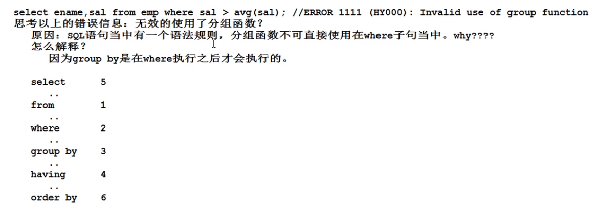
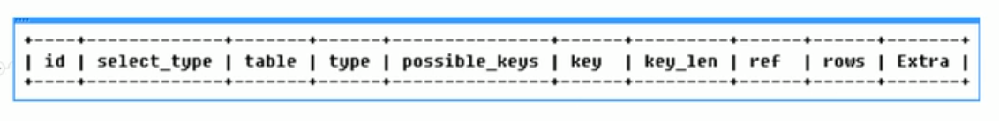
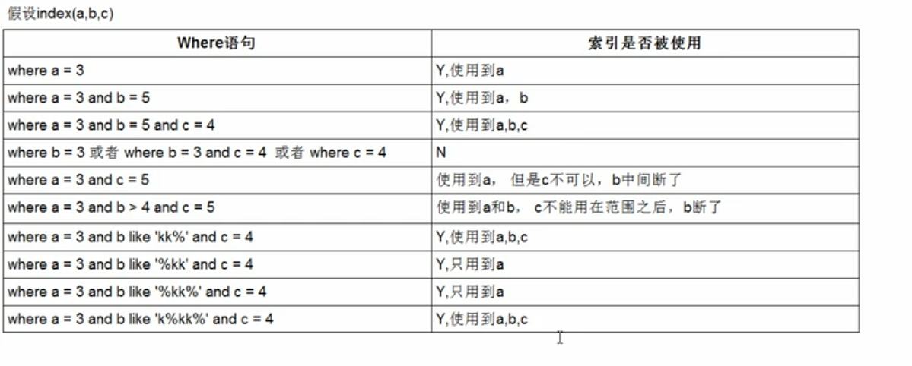

### MYSQL数据库老杜教程（动力节点）

7/7

#### SQL语句分类：

DQL（数据查询语言）：查询语句，凡是select语句都是DQL

DML（数据操作语言）:insert delete update 对表数据增删改

DDL（数据定义语言）：create drop alter 对表结构增删改

TCL（事务控制语言）：commit  rollback

DCL (数据控制语言)：grant授权 revoke撤销权限

sql脚本中的数据量太大的时候，无法打开，请使用source命令完成初始化。

使用desc table名；显示表结构

##### 条件查询

select 字段，字段... from 表名 where...  (先执行from 然后where 最后select)

between...and...是闭区间  要注意左小右大

找出薪资大于1000并且部门编号是20或30部门的员工：（注意and会自动匹配）

select ename,sal,deptno from emp where sal>1000 and (deptno = 20 or deptno = 30);

in等同于or       in(200,500)意思是等于200或者500

##### 模糊查询like

%代表任意多个字符  _代表任意一个字符

##### 排序

ORDER BY 默认是升序

asc是升序  desc是降序  select ename,sal from emp order by sal desc;//降序

例子：**按照工资降序排列，当工资相同时按照名字的升序**：

 select ename,sal from emp order by sal desc，ename asc;

注意：越靠前的字段越能起到主导作用，只有当前面的字段无法完成排序的时候，才会启用后面的字段。

**一条sql语句的执行顺序**   

select *            3

from table       1

where 条件       2

order by ...        4

##### 分组函数

**分组函数自动忽略null**    不需要在后面加上where xxx is not null;

分组函数又叫多行处理函数    有sum()  count()  avg()   max()  min()

group by:按照某个字段或者某些字段进行分组

having: having是对分组之后的数据进行再次过滤  所以有group by才能用having

分组函数一般都会和group by联合使用，这也是为什么它被称为分组函数的原因。

当sql语句没有group by时，其实是缺省了。

**任何一个分组函数都是在group by执行结束之后才执行**

例：找出**每个**工作岗位的最高薪资：select max(sal),job from emp group by job;

例：找出工资高于平均工资的员工。

**where后面不能直接用分组函数**   

正确的sql：select ename,sal from emp where sal > (select avg(sal) from emp); 

多个字段可以联合起来一块分组：

例：找出每个部门不同工作岗位的最高薪资

​      select deptno,job,max(sal) from emp group by deptno,job;

例：找出每个部门的最高薪资，要求显示最高薪资大于2900的数据。

有两种方法：

1. select max(sal),deptno from emp group by deptno having max(sal) > 2900; //这种方法效率低

​    2.select max(sal),deptno from emp where sal > 2900 group by deptno;

但是where搞不定的就只能用having了

 

#### 7/8

##### 查询结果去重

distinct只能出现在所有字段的最前面

select distinct deptno,job from emp 是对deptno,job两个联合字段进行去重

例：统计岗位的数量

select count(distinct job) from emp;

##### 连接查询

实际开发一般都是多张表联合查询

根据表的连接方式来划分，包括：

​         内连接：等值连接   非等值连接    自连接

​         外连接：左外连接   右外连接

​         全连接 （很少用）

笛卡尔积现象：当两张表进行连接查询的时候，没有任何条件进行限制，最终的查询结果条数是两张表记录条数的乘积。

表的别名：select e.ename,d.dname from emp e,dept d;

表的别名有什么好处？第一：执行效率高  第二：可读性好。

如果不加别名的话，上面查询ename的时候会从emp和dept两张表里面找ename。

怎么避免笛卡尔积现象？ 加条件进行过滤。 不会减少记录的匹配次数。

##### 内连接

A表和B表的数据匹配上就查  匹配不上就跳过  A表和B表时对等的。

等值连接：

select e.ename,d.dname from emp e join dept d on e.deptno = d.deptno;

非等值连接：连接条件中的关系是非等量关系。

select e.ename,e.sal,s.grade from emp e inner join salgrade s on e.sal between s.losal and s.hisal;

自连接：一张表看做两张表 自己连接自己。

案例：找出每个员工的上级领导，要求显示员工名和对应的领导名。

select a.ename,b.ename from emp a join emp b on a.mgr = b.empno; 

##### 外连接(使用更多)  使用外连接可以保证一张表的数据不丢失

假设A和B表进行连接，使用外连接的话，AB两张表中有一张表是主表，一张表是副表，主要查询主表中的数据，捎带着查询副表。当副表中的数据没有和主表的数据匹配时，会自动模拟出Null值。

案例：查每个员工的上级领导（要求查全部员工的  包含king的）

用左连接： select a.ename,b.ename from emp a left join emp b on a.mgr = b.empno;

用右连接：select a.ename,b.ename from emp b right join emp a on a.mgr = b.empno;

#### 7/9

##### 三张表怎么连接查询？

案例：找出每一个员工的部门名称、工资等级、以及上级领导。

select e.ename,d.dname,s.grade from emp e

join dept d on e.deptno = d.deptno

join salgrade s on e.sal between s.losal and s.hisal

left join emp el on e.mgr = el.empno;

##### union 可以将查询结果集相加

两张表的查询结果列数要相同。

#### 7/10

limit是mysql特有的，其他数据库没有。

语法：limit startIndex,length

案例：取出工资最高的前5名员工

select ename,sal from emp order by sal desc limit 0,5;

**注意下标从0开始**

每页显示pageSize条记录：第pageNo页：(pageNo - 1) * pageSize,pageSize

##### 建表

char和varchar的区别：char是定长 不智能   varchar可以动态的分配内存。

char和varchar怎么选择？如果某个字段数据长度不发生改变，比如性别、生日都是选char；长度不确定如简介、姓名就用varchar。

##### 约束

添加约束的目的是为了保证表中的数据的合法性、有效性、完整性。

常见的约束有：非空约束、唯一约束(unique)、主键约束、外键约束。

唯一约束修饰的字段具有唯一性，不能重复，但可以为null。

给两个列或者多个列添加unique: unique(usercode,username);

外键约束：

​     业务背景：设计数据表，维护学生和班级信息。

​      最好设计成两张表：班级表和学生表，如果只设计一张表有冗余。

​      一个班级里可以有多个学生，在学生表里加一个列class_id，将其和班级表的cid对应起来：

​      foreign key (class_id) references classes (id);

​      这样，在学生表插入数据的时候，如果class_id是班级表中不存在的cid，则插入失败。

外键约束的列所引用的列不一定是主键，但要有**唯一性**。

#### 7/14

Mysql默认采用InnoDB存储引擎  支持事务

MyISAM引擎不支持事务  它采用三个文件表示每个表 ：格式文件（存储表结构的定义）  数据文件（存储表行的内容）  索引文件（存储表上的索引）

InnoDB支持事务、行级锁。 安全得到保障。

#### 事务

什么是事务？  一个事务是一个完整的业务逻辑单元，不可再分。

比如银行账户转账，要么同时失败要么同时成功。

事务的存在是为了保证数据的完整性，安全性。

##### 事务的四大特性：

A  原子性：事务是最小的工作单元，不可再分。

C  一致性：事务必须保证多条DML语句同时成功或者失败。

I  隔离性：事务A和事务B之间具有隔离性。

D 持久性：最终数据必须持久化到硬盘文件中，事务才算成功的结束。

##### 事务之间的隔离性

存在隔离级别，理论上有**四个**：

第一级别：读未提交（read uncommitted)  当前事务可以读到对方**未提交**的事务。

​                    存在脏读现象，表示读到了脏的数据。

第二级别：读已提交(read committed)  对方事务**提交之后**的数据我方可以读到。没有提交的就读不到。

​                    存在的问题：不可重复读。（就是说我一开始查询数据是10条，中途别人删了一条数据之后我再读取变成9条了）

​                    解决了：脏读现象。

第三级别：可重复读（repeatable read)   解决了：不可重复读问题。

​                    （意思是原本是10条，别人删了1条，我读的还是10条）

​                    存在的问题是：读取到的数据是幻象。

第四级别：序列化读/串行化读

​                    解决了所有问题。但是效率低，需要事务排队。

mysql数据库默认的隔离级别是：可重复读。

oracle数据库默认的隔离级别是：读已提交。

#### 7/15

mysql默认是支持事务自动提交的，执行一条DML语句，其实是提交了事务。之后再rollback也是无法撤销的。

想要手动进行事务控制，输入START TRANSACTION 命令，之后如果没有输入commit的话，回滚会撤销所有的增删改操作，但是commit之后再rollback也撤销不了了。

##### 设置Mysql的隔离级别

读未提交：set global transaction isolation level read uncommitted;

读已提交：set global transaction isolation level read committed;

可重复读：读到的是幻觉。

串行化：需要排队，就是一个事务在没有提交的时候，另一个事务不能进入这张表进行操作，会导致用户体验不好。

#### 索引

##### 什么是索引？有什么用？

索引就相当于一本书的目录，通过目录可以快速找到对应的资源。

根据索引检索，效率很高。

##### 索引为什么可以提高检索效率?

最根本的原理是缩小了扫描的范围。

索引虽然可以提高检索效率，但是不能随意的添加索引，因为索引也是数据库当中的对象，也需要数据库不断的维护。如果表中的数据经常被修改就不适合添加索引，因为数据一旦被修改，索引就需要重新排序。

##### 添加索引：

create index 索引名称 on 表名(字段名)

比如给薪资sal字段添加索引：create index emp_sal_index on emp(sal)；

##### 删除索引：

drop index 索引名称 on 表名；

##### 查看索引：

show index from 表;

##### 索引底层采用的数据结构是：b+树

（一般在数据库系统或文件系统中使用的B+Tree结构都在经典B+Tree的基础上进行了优化，增加了顺序访问指针，也就是说实际上使用的是带有顺序访问指针的B+Tree）

在B+Tree的每个叶子节点增加一个指向相邻叶子节点的指针，就形成了带有顺序访问指针的B+Tree。做这个优化的目的是为了提高区间访问的性能

##### 索引的实现原理？

通过B + 树缩小扫描范围，底层索引进行了排序，分区，索引会携带数据在表中的物理地址，最终通过索引检索到数据后，获取到关联的物理地址，通过物理地址定位到表中的数据，效率是最高的。

##### 索引的分类

单一索引：给单个字段添加索引

复合索引：给多个字段联合起来添加1个索引

主键索引：主键上会自动添加索引

唯一索引：有unique约束的字段上会自动添加索引

##### 索引什么时候失效？

模糊查询的时候，第一个通配符使用的是%，这个时候索引是失效的。

##### 索引中除了存储列的值，还存储着一个指向在行数据的索引

b+树：

非叶子节点不存储真实的数据，只存储指引搜索方向的数据项。

3层的b+树可以表示上百万的数据，如果上百万的数据查找只需要三次IO，性能提高将是巨大的，如果没有索引，每个数据项都要发生一次IO，那么总共需要百万次的IO，显然成本非常非常高。

##### 哪些情况需要创建索引？

1.主键自动建立唯一索引

2.频繁作为查询条件的字段应该创建索引

3.外键关系建立索引

4.查询中排序的字段，排序字段若通过索引去访问将大大提高排序速度

##### 哪些情况不要建索引？

1.表记录太少

2.经常增删改的表

3.如果某个数据列包含很多重复的内容，就没必要为它建立索引

MyISAM中索引检索的算法为首先按照B+Tree搜索算法搜索索引，如果指定的Key存在，则取出其data域的值，然后以data域的值为地址，读取相应数据记录。

MyISAM的索引方式也叫做“非聚集”的，之所以这么称呼是为了与InnoDB的聚集索引区分。

MyISAM索引文件和数据文件是分离的  索引文件仅保存数据记录的地址

InnoDB的数据文件本身就是索引文件 数据记录本身被存于主索引（一颗B+Tree）的叶子节点上

##### Explain

explain + sql语句

##### id

如果相同，可以认为是一组，从上往下按顺序执行。如果不同，id大的先执行。

##### select_type:

有simple、primary、subquery、derived、union、union result。

table：显示这一行数据是哪张表的。

##### type:

从最好到最差依次是：system>const>eq_ref>ref>range>index>ALL

   ALL表示是全表扫描，是最差的。百万级别的数据一定要建索引进行优化。

  system：表只有一行记录（等于系统表）  平时不会出现，忽略不计。

   const：表示通过索引一次就找到了，所以很快。

​    eq_ref:唯一性索引扫描，对于每个索引键，表中只有一条记录与之匹配。常见于主键或唯一索引扫描。

​    ref:非唯一性索引扫描，返回匹配某个单独值的所有行。

​    range:只检索给定范围的行。比全表扫描好。是where语句中出现了between,<,>,in等查询。

​     index:full index scan 全索引扫描,与ALL的区别是index只扫描索引树。

#####     一般来说，至少要到达range，最好到ref。

##### possible_keys:

显示可能应用在这张表中的索引，一个或多个。查询涉及到的字段上若存在索引，则该索引将被列出，但不一定被查询实际使用。

##### key:

实际使用的索引，如果为null，则表示没有使用索引。

##### key_len:

表示索引中使用的字节数，是索引字段的最大可能长度，并非实际使用长度。同样查询精度的情况下，key_len越小越好。

##### ref:

显示索引的哪一列被使用了。

##### rows:

根据表统计信息及索引选用情况，大致估算出找到所需记录所需读取的行数。rows越少越好。

##### extra:

using filesort 说明mysql会对数据使用一个外部的索引排序，而不是按照表内的索引顺序进行读取。不好。

using temporary 说明使用了临时表来保存中间结果，常见于排序order by 和 分组查询group by。 很伤性能，不好。

using index  好。

using where 表示使用了where 

using join buffer 使用了连接缓存

#### 优化

##### 一张表的优化：

例：查询category_id为1且comments大于1的情况下，views最多的article_id。

如果建立索引时对三个字段一起创建一个复合索引，会导致using temporary的出现。因为comments是一个范围，mysql无法利用索引再对后面的views部分进行检索，即range类型查询字段后面的索引无效。

此题更好的的创建索引：

create index idx_article_cv on article(category_id,views);

##### 两张表的优化：

left join: 左表是全都有，关键在右表，所以要给右表建索引。

right join:在左表建索引。

##### 三张表的优化：

永远用小结果集驱动大的结果集。比如书的类别class和书籍总数books，那就是class left join books。

#### 索引优化

1.最左前缀法则（最左前缀法则是指查询从索引的最左前列开始并且**不跳过索引中间的列**）

例如，给三个字段建了联合索引(name,age,pos)，在查询数据库的时候如果没有用到name就会造成索引失效，此时会变成全表扫描。

记住：**带头大哥不能死，中间兄弟不能断，永远遵守最佳左前缀**。

2.在索引列上做了其他操作（计算，函数，自动或手动的类型转换），会导致索引失效

3.使用了索引中范围条件右边的列。例如，where name='july' and age > 25 and pos='a'; 这里pos是用不到的。**范围之后全失效**

4.尽量使用覆盖索引（建的索引列和查询列一致），避免使用select *。

5.！=  和<>都会导致索引失效。但是这要根据业务需求来定，不能因为索引失效就不用！=。

6.is null和is not null也无法使用索引

7.like以通配符开头('%abc...') 会索引失效变成全表扫描。**%最好加在右边**，才能避免索引失效，例如'july%'。

##### 问：怎样在不得不使用'%...%'的情况下还索引不失效？

​     使用覆盖索引。就是select后面的字段不能有没加索引的字段，更不能直接用select *。例如只给name,pos加了索引，结果查的时候写的是select name,pos,email from...where name like '%aa%' 这时候就索引失效了，因为用到了没加索引的email。

8.字符串不加单引号索引失效。varchar类型绝对不能失去单引号。

例如name是varchar类型，如果写的是where name = 2000  会导致索引失效，变成全表扫描。因为mysql会自动将2000转换为'2000'。

9.少用or，用它来连接时会索引失效。

##### 索引小结

##### sql例题：

##### 1.查出每个部门最高薪资的人员名字。

注意：按部门分组后查最高薪资很容易，但是同时还要查名字，并且，一个部门最高薪资可能不止一个人。

**错误的sql**:  select ename,deptno,max(sal) as maxsal from emp group by deptno;

这种查出来每个部门就一个最高员工拿最高薪资。

**正确的sql**：

select e.ename,t.deptno,t.maxsal from (select deptno,max(sal) as maxsal from emp group by deptno) t join emp e on t.deptno = e.deptno and t.maxsal = e.sal;

on后面的条件有两个，缺一不可，既要保证部门相同，而且由于是要查最高薪资的员工，所以薪资也要相等，不然就是全部薪资都查出来了。

##### 2.哪些人的薪水在部门的平均薪水之上。

和上题思想一样，要先查出每个部门的平均薪水，然后将其当做t表，t表和emp表连接。

select t.*,e.ename,e.sal from emp e join (select deptno,avg(sal) as avgsal from emp group by deptno) t on e.deptno = t.deptno and e.sal > t.avgsal;

##### 3.不准用组函数(Max)取得最高薪水。

方法一：降序

select ename,sal from emp order by sal desc limit 1;

方法二：表的自连接(

只有最大的那个薪资才找不到比它大的数。

select sal from emp where sal not in (select distinct a.sal from emp a join emp b on a.sal < b.sal);

#### 范式

1NF 2NF 3NF BC等

关系数据库中的关系必须满足一定的要求，满足不同程度要求的为不同的范式。

1NF：第一范式，每个属性都不可再分。第一范式是对关系模式的最起码的要求。

2NF：第二范式。

3NF：第三范式。

#### MySQL锁

#### 锁的分类：

##### 从对数据操作的类型来分类：读锁和写锁。

读锁（共享锁）:针对同一份数据，多个读操作可以同时进行而不会互相影响。

写锁（排它锁）：当前写操作没有完成前，它会阻断其他写锁和读锁。

##### 从对数据操作的粒度来分类：表锁（偏读）和行锁（偏写）。

##### 表锁：

偏向MyISAM引擎，开销小，加锁快；无死锁；锁定粒度大，发生锁冲突的概率最高，并发度最低。

锁表：lock table 表名 read/write。

释放锁：unlock table 表名;

session1如果给mylock表加了read锁，可以读mylock，不能写mylock，也不能读别的表。

session2连接mysql后，可以读mylock表，也可以读或者写其他的表，但是要对mylock表进行update操作时会进入阻塞，只有在session1中对mylock表进行unlock后，session2才能update。

#### Truncate与delete的区别

truncate table：只能删除表中全部数据

delete from table where……，可以删除表中全部数据，也可以删除部分数据。

truncate的执行速度比delete快。

delete执行后，删除的数据占用的存储空间还在，还可以恢复数据；truncate删除的数据占用的存储空间不在，不可以恢复数据。也因此truncate 删除后，不能回滚，delete可以回滚。

