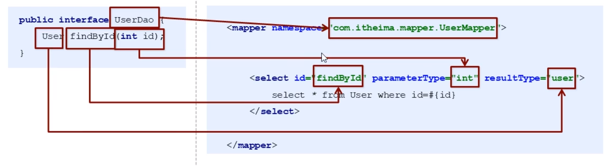
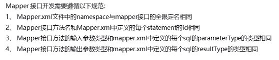

### day01  入门

框架封装了很多细节

Ioc  反转控制   AOP 面向切面编程

##### mybatis概述

是一个持久层框架 用java编写的  它封装了jdbc操作的很多细节，使我们只需要关注sql语句本身  它使用了ORM思想实现了结果集的封装，使得开发者只需要关注sql语句本身，而不需要花费精力去处理加载驱动、创建连接、创建statement等繁杂的过程。

ORM：Object Relation Mapping 对象关系映射

##### mybatis入门：

​       环境搭建：创建maven工程；创建实体类和dao的接口；创建mybatis主配置文件；创建映射配置文件。

​       在resources中创建directory时要一级一级创建才是多级目录。

​       mybatis的映射配置文件位置必须和dao接口的包结构相同

​       映射配置文件的操作配置，id属性的取值必须是dao接口的方法名

​       遵从上述法则后，在开发中无需再写dao的实现类，只需定义个接口

**使用注解更方便：移除IUserDao.xml，在dao接口的方法上面使用@Select注解，同时需要在config.xml中的mapper配置时，使用class属性指定dao接口的类名。**


MyBatis中执行更新操作时，要提交事务。

### xml方式：

#### 插入操作

要使用#{}

`<insert id="" parameterType=""> sql语句 </insert>`


#### 修改操作

`<update id="" parameterType=""> `

`update  表名 set ...#{}...`

`</update>`


#### 删除操作

`<delete id=""  parameterType="">`

`delete from 表 where id=#{任意字符串}`

`</delete>`

执行的时候 sqlSession.delete("namespace.id",参数值)。


typeAliases标签定义别名，可以让代码简化一点。比如用user代替com.domain.User:

```java
<typeAliases>
    <typeAlias type="com.domain.User" alias="user"></typeAlias>
</typeAliases>
```


##### 主流开发方式是采用Mybatis的代理开发方式实现DAO层的开发。

**映射文件中的namespace是用于绑定Dao接口的，即面向接口编程。**当namespace绑定接口后，就可以不用写接口的实现类，mybatis会自动找到该接口下的方法所对应的sql语句：

```java
public interface IUserDao {
    List<User> findAll();
}

<mapper namespace="com.dao.IUserDao">
    <!---这里的id不能随便写 要写类里面的方法名称  还要说明封装到哪里去-->
    <select id="findAll" resultType="user">
        select * from user;
    </select>
</mapper>
```

要按照规范一一对应：





面向接口编程的代码见`E:\JavaStuding\Mybatis\day_01\day01_01mybatis`（理解并记住）:accept:

主流方法的执行代码：

```java
InputStream is = Resources.getResourceAsStream("SqlMapConfig.xml");
SqlSessionFactory factory = new SqlSessionFactoryBuilder().build(is);
SqlSession session = factory.openSession();
IUserDao userDao = session.getMapper(IUserDao.class);
然后调用userDao下面的方法。
```

SqlMapConfig.xml文件是配置数据库的，并且指定含有sql语句的那个xml文件的所在位置。


#### 分页查询

PageHelper.startPage(起始页数，每页显示的条数)。

用plugins标签配置插件。


一个老师有多个学生，多个学生有同一个老师。

#### 多对一查询

学生类中要写Teacher teacher;

使用`<association property="teacher" javaType="Teacher">...</association>`表示关联的对象。

返回的结果集是Student，其中要包含学生的老师信息。

#### 一对多查询

老师类中要包含`List<Student> students;`

用`<collection property="students" ofType="Students">...</collection>`表示关联的对象。

（理解：一对多，要封的就是多，所以类中有List，用collection集合)

返回的老师结果集中包含他教的全部学生信息。

#### 多对多

也用collection进行关联映射。

涉及三张表，比如学生表，课程表，学生选课信息表。

StudentMapper.xml 的配置如下：

```xml
<?xml version="1.0" encoding="UTF-8"?>
<!DOCTYPE mapper PUBLIC "-//mybatis.org/DTD Mapper 3.0" "http://mybatis.org/dtd/mybatis-3-mapper.dtd">
<mapper namespace="gler.mybatis.manytomany.mapper.StudentMapper">
    <!-- 查询所有学生及他们的选择课程的信息 -->
    <select id="selectStudentCourse" resultMap="studentCourseMap">
        select
        s.*,c.* from
        tb_student s,tb_course c,tb_select_course sc
        where s.s_id=sc.sc_s_id
        and c.c_id=sc.sc_c_id
    </select>

    <!-- resultMap:映射实体类和字段之间的一一对应的关系 -->
    <resultMap id="studentCourseMap" type="Student">
        <id property="id" column="s_id" />
        <result property="name" column="s_name" />
        <result property="sex" column="s_sex" />
        <result property="age" column="s_age" />
        <!-- 多对多关联映射：collection -->
        <collection property="courses" ofType="Course">
            <id property="id" column="c_id" />
            <result property="name" column="c_name" />
            <result property="credit" column="c_credit" />
        </collection>
    </resultMap>
</mapper>
```


这种一对多、多对一、多对多，都要用`resultMap`进行映射封装。

```java
<select id="" resultMap="user">
    ...
</select>	
<resultMap id="user" type="">
    ....
</resultMap>
```
###### 注意column是数据库表查出来的列名字，property是java类里面对应的属性名。是从column取值注入给property。


### 注解方式：

在mybatis中针对CRUD一共有四个注解：

@Select ("select * from ...")

@Insert ("insert into ...values()")

@Update ("update 表 set....")

@Delete(“delete from 表...”)

整个开发要用注解就都用注解，如果既有注解又有xml就会出错。

将之前写sql语句的xml文件删掉，在核心配置文件中要加载映射关系：

```xml
<mappers>
	<package name="接口所在的包路径"></package>
</mappers>
```

注解实现复杂映射：

使用@Results封装。（如果是单表查询则不需要这个）

如果两张表是一对一关系，则用one=@One(select="要调用的接口地址")，

如果是一对多则用many=@Many(select="要调用的接口地址")。

采用分步骤，先查user表信息，然后再根据user表中的id来查orders表信息：

```java
@Select("select * from user")
@Results({
        @Result(column = "id",property = "id"),
        @Result(column = "username",property = "username"),
        @Result(column = "birthday",property = "birthday"),
        @Result(column = "sex",property = "sex"),
        @Result(column = "address",property = "address"),
        @Result(property = "orderList",
                column = "id",//表示根据user表中的id来查
                javaType = List.class,
                many = @Many(select = "com.dao.OrderMapper.findByUid"))
})
List<User> findUserAndOrder();

//然后找到下面的接口中的方法
public interface OrderMapper {
    @Select("select * from orders where uid=#{uid}")
    public List<Order> findByUid(int uid);
}
```

多对多查询其实跟一对多差不多，只是在sql语句中要多关联一张表。


