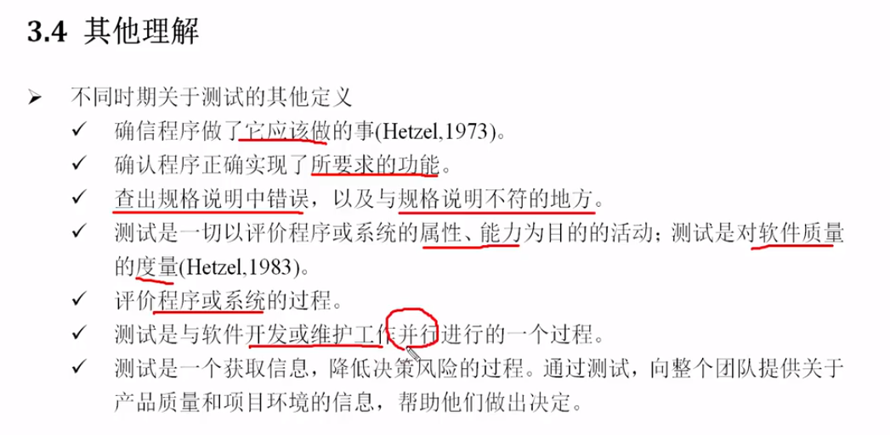

### 测试

#### Selenium

是一个Web应用的自动化框架

通过它 可以写出自动化程序  可以自动化的控制浏览器

环境安装需要安装客户端库和浏览器驱动


如何找到页面想要的元素是重中之重

通过webdriver找：

```python
from selenium import webdriver

wd = webdriver.Chrome(r'd:\JaniceDownload\chromedriver\chromedriver.exe')
wd.get("https://www.baidu.com")
element = wd.find_element_by_tag_name('span') //找所有的span标签
```

根据webelement对象找：

```python
wd = webdriver.Chrome(r'd:\JaniceDownload\chromedriver\chromedriver.exe')
wd.get("https://www.baidu.com")
element = wd.find_element_by_id('container')
spans = element.find_elements_by_tag_name('span')//只找container下的span标签
```

一般服务器的响应比我们代码的查询速度要慢很多，所以我们在查网页返回结果的元素时，最好设置：wd.implicitly_wait(10)  这样代码每隔半秒就去查询一下网页。

获取css:

比如说想获取类名为plant的css：

```python
wd.find_element_by_css_selector('.plant')
```


#### 测试的定义

软件包括程序、数据和文档，所以除了程序外，数据和文档也需要测试



#### 软件测试的过程

1.分析测试需求

2.编写测试计划

计划的内容：产品概述、测试范围、测试区域/目标、测试优先级、测试周期、进度安排、测试方法、需交付文档等等。

3.设计与编写测试用例

4.执行测试

搭建测试环境    执行测试用例    提交和跟踪缺陷

5.评估与总结


#### 软件质量需求

测试目标包括：功能、性能、界面、易用性、兼容性、安全性、可用性、可维护性、可扩展性等

界面应布局合理 文字没有乱码 字体大小合适 颜色使用恰当  舒适美观


#### 研读需求文档

（一般读文档要花很长时间）

要提取有用的需求信息

提出需求中不清晰 不理解 不明白的问题  

要和开发人员  用户等沟通


